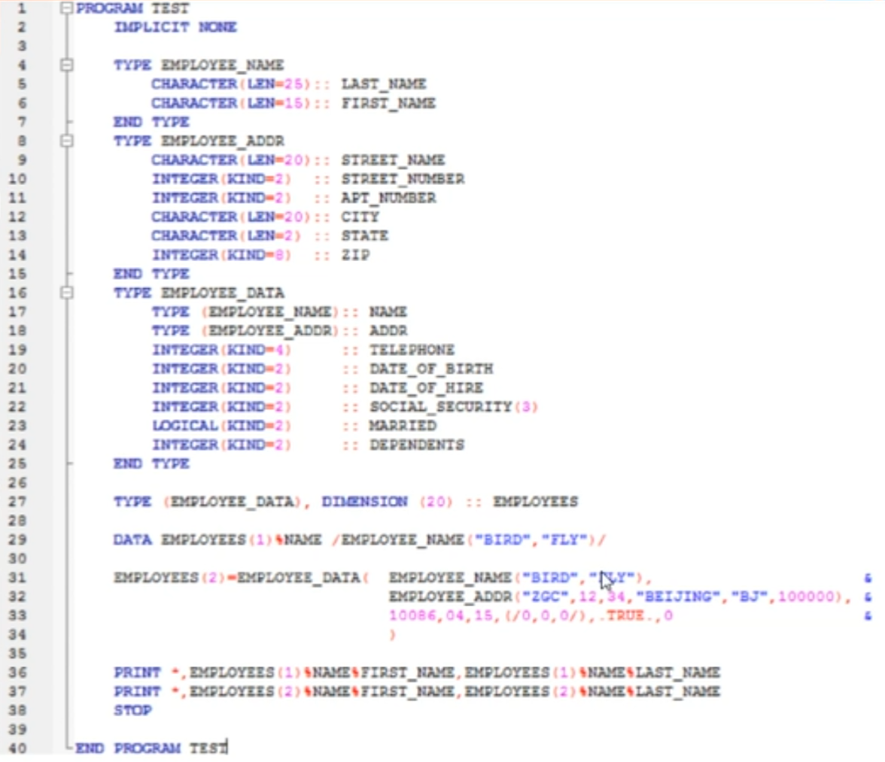
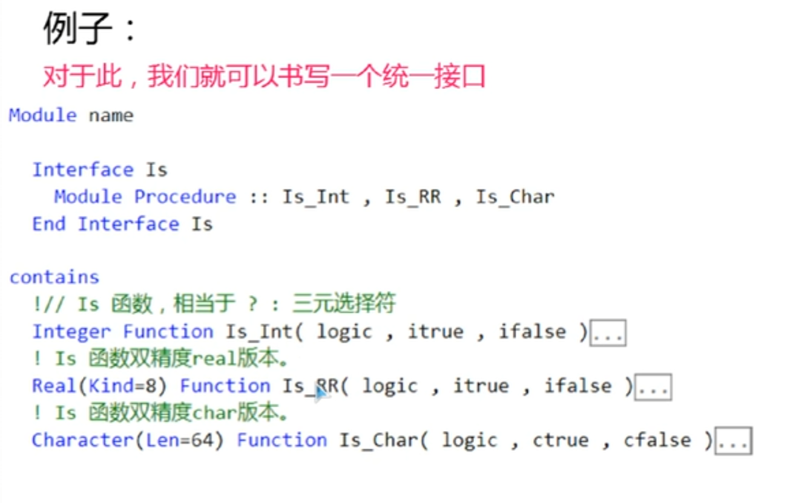
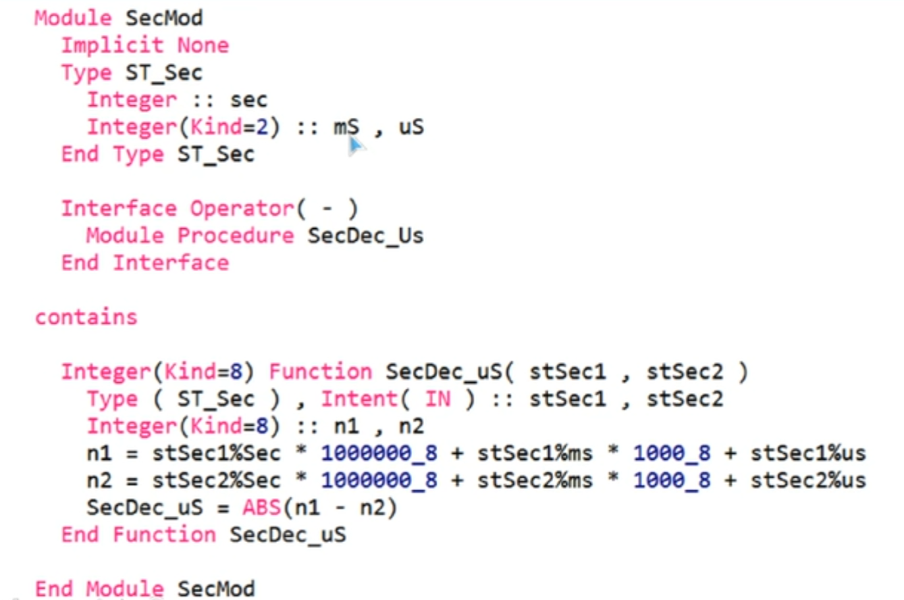
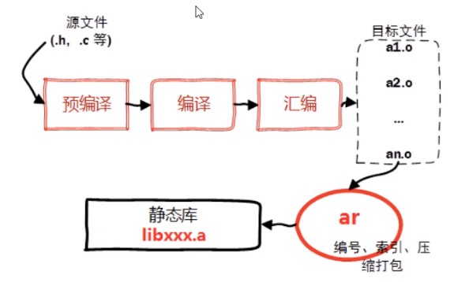
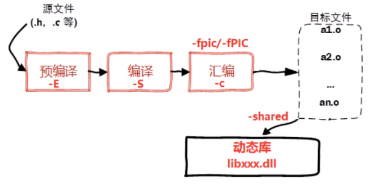
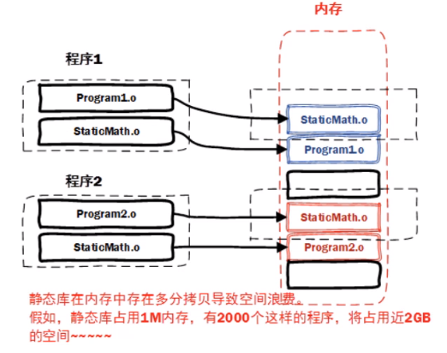
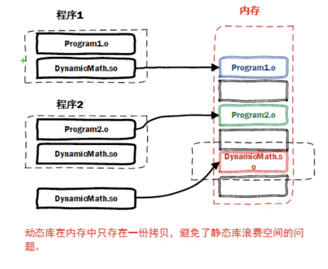

# Fortran_note
## 1.常见编译环境操作
gfortran首先需要函数进行编译，生成.o文件，即编译后的文件；然后使用命令将编译后的文件打包成可执行文件。

例子：
    
    当.o文件数量较少时，使用如下命令编译、运行文件
    gfortran -c 文件名.f90                                  编译生成.o文件
    gfortran 文件名.o(可以是多个.o文件) -o 可执行文件名字    链接生成可执行文件

    也可以使用该命令代替上两个命令:
    gfortran 文件名.f90(可以是多个.f90文件) -o 可执行文件  -fcheck=bounds  
    (-fcheck=bounds 用于显示检查出的错误) 

    当.o文件数量较多时，使用shell脚本或者make命令
## 2.常见问题的检测和排查
### 2.1 常见编译错误
Syntax Error 是最基础的编译错误（不符合语法规范）
Unrecognized token 不识别命令，可能是中文括号的问题
Unbalanced parentheses 括号之间不对应，可能是一个左括号对应多个右括号
A specification statement cannot appear in the executable section 声明语句必须放在运行语句的上面

### 2.2 常见链接错误
链接错误种类最少，涉及用户代码部分容易解决。涉及编译器运行时库、第三方函数库、混编时不易解决。

### 2.3 常见运行时错误
运行时错误种类较少，大多数比较难解决。运行时错误几乎无法完全避免。
Program Exception - access violation 所有的内存读取错误均报这个错误。

## 3.语法之源代码结构
### 3.1 固定格式和自由格式
                  固定格式                自由格式
    英文        Fixed-format            Free-format
    扩展名       .for .f ...           .f90 .f95 .f03
    语法   F66 F77 F90 F95 F03 F08   F66 F77 F90 F95 F03 F08
    格式       代码从第7格开始              任意
    续行    在第6格键入一个非0字符      在前一行最后加入&
    行宽             72                      132
    注释        行首打C或c或*            注释前打感叹号！
    说明        不推荐，已废止               推荐

### 3.2 程序单元
字符到程序之间的关系：
字符 => Token => 语句 => 程序单元 => 模块（module） => 程序
程序单元是指：执行某一特殊任务的具有一定独立性的代码区域。

### 3.3 语句类型
Fortran语句大致有三种类型：
1.声明语句：在编译时，告知编译器关于变量的信息

2.执行语句：在运行时，执行以便完成特定的任务

3.结构语句：仅作为代码结构划分使用

### 3.4 变量的定义和声明
建议显式声明所有变量，如果未显式声明变量，则按照IN规则确定类型(ijklmn开头为整形，其他为实型)，因此，为了抛弃IN规则，建议在每一个程序单元，使用Implicit None

变量类型：主要有整型(Integer)、实型(Real)、字符型(Character)

还有Complex类型(本质上是real)、派生(type)类型(是其他类型的集合)

整型无误差、实型有误差

字符型是接近人类的语言

#### Fortran声明变量的基本格式：
    
    类型(属性)，形容词，形容词... :: 变量名(数组外形) = 值，变量名2(数组外形) = 值
    例： Real(Kind=8) , parameter , private :: rVar = 20.0d0
         Character(Len=32) , Intent(In) :: cStr(5,8)

<mark> 注意： 如果定义时同时赋值，则默认具有save属性，需书写双冒号 <mark>

## 4.语法之数据类型与浮点数
### 4.1 数据类型
#### Fortran标准数据类型
<mark> Fortan不区分大小写 <mark>

    Integer(Kind=??) ::                 整型
    Real(Kind=??) ::                    实型/浮点型
    Complex(Kind=??) ::                 复数型（两个实型的组合）
    Logical(Kind=??) ::                 逻辑型/布尔型
    Character(Kind=1,len=??) ::         字符型(.true.   or   .false.)
    Type(??) ::                         派生类型（上述类型的组合）
<mark> 数据除了有类型外，还有一定的属性。他们用定义时的形容词来赋予。在使用浮点数时，即使没有小数部分，也要加上小数点。 <mark>

形容词parameter代表这个数据有常数的属性。

### 4.2 Kind
Kind的正式名字叫“种别”，是区分同一种数据类型，但不同长度、或精度、或编码方式的一种代号。他在编译时决定！
<mark> Kind对不同的变量类型，表达的意思也不相同 <mark>

    对Integer,Kind值影响整数能表达的最大范围。
    对Real和Complex,Kind值影响实数的最大范围和最小精度。
    对Character,Kind值表示编码。通常为ASCII编码。
    对Logical,Kind值表示长度，对逻辑型无影响。

<mark> ①Integer的Kind，常见1、2、4、8等 <mark>
                      
                      最小值                  最大值
    1    超短整型    -(2^7)                   2^7-1
                    -128                     127
    2    短整型      -(2^15)                  2^15-1
                    -32768                   32767
    4    整型       -(2^31)                  2^31-1
         长整型     -2147483648              2147483647
    8    超长整型   -(2^63)                  2^63-1
                   -9223372036854775808     9223372036854775807
    
    对于大多数编译器，Kind默认是4，占有4个字节。同时，并不是所有的编译器都支持1、2、4、8的Kind值。
k=Selected_Int_Kind(i)可以用这个函数来选择能满足要求的Kind。i表示需要最大的十进制位数，k表示返回的能满足范围的最小的Kind值。

<mark> ②Real的Kind，常见4、8、16等 <mark>

                           最大值               最小精度 
    4       实型         3.4028235E+38          1.1754944E-38
    8       双精度       1.7976931E+308         2.2250738E-308
    16      四精度       1.1897314E+4932        3.3621031E-4932
    
    对于大多数编译器，Kind默认是4，占有4个字节。并不是所有编译器都允许4、8、16的Kind值。
k=Selected_Real_Kind(r,p)可以用这个函数来选择能满足要求的Kind。r表示需要最大的十进制位数，p表示最小的有效位数，k表示返回的能满足范围的最小的Kind值。

<mark>③Complex的数据类型与Real一致。 <mark>

    需要注意：
        如果Kind=8的Real占用8字节，则Kind=8的Complex占有16字节。
        Complex选择Kind，也使用Selected_Real_Kind函数。

<mark>④Character的Kind <mark>

    Character的Kind，常见只有一种，即1表示ASCII编码，通常忽略。

<mark>⑤Logical的Kind </mark>

    Logical的Kind通常与该编译器支持的Integer一致，通常忽略，在大多数编译器上，Kind=4，占有4字节。
    任何Kind值的Logical都只能表示真、假两个状态。
    Logical没有可以选择Kind值的函数。

### 4.3 整型和字符型
#### 整型：
需要注意整型变量的最大范围，尤其在阶乘、指数等可能产生较大数据的计算中，必须预先做出评估。

其次注意，整型和整型的计算结果依然是整型。

例如：1/2=0；3/2=1

<mark>因此，推荐在浮点数的表达式中，尽量把常数写成浮点数 <mark>

#### 字符型：
需要注意字符串定义时必须有长度，且通常是固定的。

Fortran的字符串没有结束符\0，所以在字符串操作中，必须注意！

<mark>字符串拼接起来用// <mark>

有必要时需使用trim去除尾部空格

<mark>可通过内部文件在字符串和整型、实型间相互转化。 <mark>
    
    read(字符串, *)整型或实型变量                    字符串->数字
    write(字符串，*)整型或实型变量                   数字->字符串

<mark>字符型允许使用“子字符串”表示字符串的一部分 <mark>

    character(len=12) :: c="www.?????.cn"
    c(5:9)="fcode"          !// 此时c="www.fcode.cn"
    c(:3)="bbs"             !// 此时c="bbs.fcode.cn"
    c(10:)=""               !// 此时c="bbs.fcode___"

### 4.4 浮点数
浮点数包含实型(Real)和复型(Complex)。计算机中浮点数的规则有很多，其中应用最多的时IEEE标准。其他的如IBM标准。正如我们用科学计数法表达实数一样，计算机也使用二进制的科学计数法表达实数。

<mark>IEEE浮点规则： <mark>

    科学计数法                     二进制科学计数法
    +6.022141290E+23               0x424A0000
    三部分组成                     三部分组成
                                  0 1000100 10010100000000000000000
    a.符号(+或-)                   a.符号（0:+  1:-）
    b.有效数6.022151290            b.有效数 10010100000000000000000
    c.指数E+23                     c.指数 10000100

    对于上式二进制科学计数法的解释：
    符号位为0，表示是正数（否则是负数）

    有效数10010100000000000000000
    第一位表示1/2，第二位表示1/4，第三位表示1/8....，取为0则不计入总数，取为1则计入总数。
    所以有效位:1/2+1/16+1/64=0.578125
    参与计算时，再加1。

    指数位1000100，对应十进制的132，它并不直接计算，而是使用与127的差值，即132-127=5。
    参与计算时，作为2的指数。

    最终计算结果：R=(-1)^0*(1+0.578125)*(2^5)=50.5

HUGEVAL是一个内置常量，它表示浮点数的最大可能值。它的值取决于所使用的浮点数类型。HUGEVAL 常量通常用于比较浮点数变量的大小，或者用于初始化变量为一个较大的值。

<mark>由于浮点数存在误差，因此，应尽量避免以下操作：<mark>

    1.对浮点数进行相等判断！
    if (a==1.3)        =>          if(abs(a-1.3)<1.0e-5>)
    2.用浮点数作为数组角标！
    b=a(2.0)           =>          b=a(2)
    3.用浮点数作为循环变量！
    Do r=0.0, 2.0, 0.1     =>      Do i=0,20
                                    r=i/10.0

## 5.语法之流程控制
### 5.1 条件判断
If常见结构：

    if (Expression) then
        ...
        ...
    end if
If复杂结构：

    if (ConditionA) then
        ...
    else if (ConditionB) then
        ...
    else if (ConditionC) then
        ...
    else
        ...
    end if

<mark>在判断两个数组的元素是否相等时可以使用all或any函数，all函数用于判断两个数组的所有元素完全相同，any函数用于判断两个数组的元素至少有一个相同。 <mark>

select case基本结构：

    select case (Expression)
        case (A)
            ...
        case (B)
            ...
        case default
            ...
    end select

### 5.2 循环
do循环常见结构：

    do i = 1,100
        ...
    end do

do while 循环结构：（当满足条件时一直循环）

    do while (Expression)
        ...
    end do

循环控制语句:cycle,exit

    cycle:忽略本轮循环剩余内容，直接进入下一轮循环。
    exit:忽略循环剩余内容，跳出循环。

### 5.3 逻辑运算
关系运算符：

    关系运算符         (或)             描述
        ==            .eq.            是否相等
        /=            .ne.            是否不相等
        >             .gt.            是否大于
        <             .lt.            是否小于
        >=            .ge.            是否大于等于
        <=            .le.            是否小于等于

逻辑运算符：

    逻辑运算符               描述
      .and.                  与
      .or.                   或
      .not.                  非
      .eqv.                  同或(前后逻辑值相同返回真)
      .neqv.                 异或(前后逻辑值不同返回真)

## 6.语法之数组和结构体
### 6.1 聚合数据
最常见的数据：

    枚举（parameter）
    数组（dimension）
    结构体（type）
    类（class, type derived）

### 6.2 数组
<mark>分类： <mark>
    
    ①固定大小数组
        静态数组（声明）
        自动数组（传参）
    ②动态分配数组（关键字：allocate、deallocate）

<mark>数组的定义： <mark>

    type, dimension(bound) [,attr] :: name 或
    type [,attr] :: name(bound)

<mark>数组的访问方式： <mark>

    整体 ARR=1(整体赋值)
    元素 ARR(1)=-1（单个元素赋值）
    片段 ARR(2:4)=10 (切片赋值)
    不连续段 (类似于切片)

<mark>数组的常用函数： <mark>

    SQRT(num) : 求方根函数
    DOT_PRODUCT(VECTOR_A, VECTOR_B) : 点积
    MATMUL(MATRIX_A, MATRIX_B) : 矩阵乘法
    SUM(ARRAY [,DIM] [,MASK]) : 求和
    PRODUCT(ARRAY [,DIM] [,MASK]) : 乘积
    MAXLOC(ARRAY [,MASK]) : 求数组最大元素位置
    MAXVAL(ARRAY [,DIM] [,MASK]) : 求数组最大元素的值

### 6.3 结构体
<mark>结构体的定义： <mark>

    TYPE [[,attr-list] ::] name [(type-param-name-list)]
        [type-param-def-stmts]
        [PRIVATE statement or SEQUENCE statement]...
        [component-definition]...
        [type-bound-procedure-part]
    END TYPE [name]

<mark>结构体的访问方式： <mark>

    TYPE%MEM

例子：


定义结构体时，内存中存储参数的顺序不一定是我们写的参数的顺序，可以加上SEQUENCE命令，保证顺序一致。

## 7 函数和子例行程序
### 7.1 函数和子例行程序
函数的调用：
    
    返回变量 = 名称([实参1， 实参2......])

函数的书写：

    [形容词][返回类型] Function名称([虚参1，虚参2......])
        [虚参的声明]
        [局部变量的定义]
        函数内部实现
            名称=返回值
        [return]
    end [Function [名称]]

子例行程序的调用：

    call 名称([实参1，实参2......])

子例行程序的书写：

    [形容词] Subroutine 名称([虚参1，虚参2......])
        [虚参的声明]
        [局部变量的定义]
        函数内部实现
        [return]
    end [Subroutine [名称]]

<mark>函数和子例行程序的区别： <mark>

          函数                            子例行程序
        有返回值                           无返回值
      调用var=函数名()                  调用call子程序名()
     可以通过虚参输出数据               可以通过虚参输出数据
     允许有多个输出数据                  允许有多个输出数据
      可以包含文件操作                    可以包含文件操作 
               函数和子例行程序其实没有什么区别            

### 7.2 虚参和实参
虚参和实参传递的方式有两种：传址和传值

### 7.3 传递数组和结构体
传递数组有三种方式：自动数组、假定大小、假定形状

<mark>自动数组： <mark>

    Subroutine sub(a,m,n)
        Integer m, n
        Real a(m,n)
        a=2
    End Subroutine sub !只传递地址，维度由定义确定，各维度上下限由其它虚参确定。

<mark>假定大小： <mark>

    Subroutine sub(a)
        Real a(*)
        a(1:6)=1
    End Subroutine sub !只传递地址，虚参只能是一维。下限为1，不传递上限。

<mark>假定形状： <mark>

    Subroutine sub(a)
        Real a(:,:)
        a=1
    End Subroutine sub !传递地址，各维度大小，下限可自动，上限自动计算。

传递结构体时需要注意，即便两个结构体完全一模一样，但是其定义是分别独立的，编译器也认为不是同一类。因此，虚参和实参如果传递结构体，必须是由同一个定义type得到的结构体实例。需在module中定义结构体，分别在主函数和子例行程序中使用。

### 7.4 特殊用法
<mark>变量的save属性： <mark>
函数的局部变量具有“临时性”，即在函数返回后，局部变量被收回，下次进入时，其值不确定。save属性可以指定一部分变量可以在函数返回后“存活”下来，下次进入同一个子程序，保持上一次的值。

例子：

    Integer , save :: var
    Integer :: var = 0 !定义时初始化值，也具有save属性

<mark>虚参的Intent属性： <mark>

明确指定虚参的目的：

    ！输入参数，在子程序内部不允许改变
    Integer , Intent(In) :: input_arg
    ！输出参数，子程序返回前必须改变(对应实参不能是参数，也不能是表达式)
    Integer , Intent(OUT) :: output_arg
    ！中性参数
    Integer , Intent(INOUT) :: neuter_arg
    Integer :: neuter_arg ！未指定 Intent则为中性 

<mark>虚参的value属性： <mark>指定该参数为传值参数，而非传址参数。

    ！传值参数，只能作为输入参数。改变后不影响实参
    Integer , value :: by_value_arg

<mark>可选参数optional： <mark>
函数的某些参数在某些情况下，可以不赋予！运行时动态决定参数的个数

<mark>result后缀： <mark>旨在通过对返回值重命名以便于理解或书写

## 8 Module
### 8.1 Interface
Interface规定了函数的调用方式、各参数的传递方式、详细信息、各种上下限、变量的限定、是否可以忽略等。

在以下用法时，必须使用interface:

    函数返回值是数组、指针
    参数为假定形状数组
    参数具有intent、value属性
    参数有可选参数、改变参数顺序

<mark>Interface书写形式<mark>：（Interface需要包含在每一个调用者函数中）

    Interface
        内容
    End Interface
    内容为把被调用者的执行语句，局部变量定义去掉

### 8.2 Module
Module用于把一部分(有关联的)数据和函数聚合起来

    1.避免手动书写interface
    2.数据共享
    3.数据与过程封装、保护、继承

函数是有输入、输出的过程，在内部实现一个特定的功能。

Module是把一系列相关的函数、及数据在封装起来实现一系列的功能组合。

Module向外提供变量（数据共享）和子程序，他们有不同的权限属性：

                         变量                   子程序
    public        外部可以读取，可以修改      外部可以调用
    protected     外部只能读取，不能修改           --
    private       外部无法访问               外部无法调用

Module可以被继承，即modA可以usemodB，从而获得modB向外提供的所有公共变量和子程序。例：

    Module monitorsys
        use smartHome
    Module monitorsys
        use smartHome, only : tv , pc  !只使用tv和pc变量
    Module monitorsys
        use smartHome, only : screen => tv , pc  !只使用tv和pc变量，并将tv改名为screen

<mark>module会降低程序编译效率<mark>

### 8.3 特殊用法
<mark>统一接口：<mark>
利用统一接口可以把多个子程序捆绑成一个名字，由编译器根据实参的情况，决定到底调用哪一个。



<mark>自定义操作符<mark>



## 9 文件读写
### 9.1 文件和路径
文本文件是特殊的二进制文件，它的所有数据都是有效的可显示的字符。

对于不同的文件形式，使用不同的方式来读取：

                    文本文件                 二进制文件
                 （有格式文件）             （无格式文件）
    
    顺序读取    顺序读取有格式文件          顺序读取无格式文件
                  （用的最多）      （在记录前后各增加4字节，表示记录长度）
    
    直接读取    直接读取有格式文件          直接读取无格式文件
                （要求每行一样长）             （用的较多）
    
    流文件             ---                      流文件
                                            （非常方便，强大）

### 9.2 顺序读写有格式文件
<mark>Open打开文件：<mark>

    Open(子句=值, 子句=值, 子句=值)
    它具有二十多个子句，每一个都有各自的作用
    真正有必要的，只有两个：
    Open(Unit=通道号，File="文件名")
    Open(通道号，File="文件名")

    文件通道号一般由程序员给定，一般使用大于10的数字，用于将数字和文件关联起来。

可以使用NewUnit子句由编译器自动分配通道号，程序号需要保存这个通道号(FILE_IN).例：

    integer :: FILE_IN
    Open(NewUnit=FILE_IN, file="2d_text.txt")

<mark>Read/Write读取文件：<mark>

    Read/Write(文件通道号, *)变量列表

    星号代表表控格式，即让变量列表自动控制格式！（一般对于read，表控格式足够）

一般来说，没有特殊情况，Read读取整个的N行。

Backspace(通道号)可以退回一行。

<mark>Close关闭文件：<mark>

    Close(文件通道号)


### 9.3 直接读取有格式文件
直接读取方式读写文本文件：可任意指定读取哪一笔记录，对于每行不一样长的文件，不适用直接读取法。

    Open(NewUnit=FID, File="text_direct.txt", form="formatted", access="Direct", RecL=64)

    form="formattted":指定它是有格式文件(文本文件)
        在顺序读取时，它是默认值，因此可以不指定
    access="Direct":指定它是直接读取方式
        在顺序读取时，可以指定‘SEQUENTIAL’它是默认值，因此可以不指定
    RecL=64:指定记录长度(Record Length)是64个字节，仅在直接读取时指定

直接读取时，Read必须指定读取格式和读取记录（在直接读取时不能使用表控格式）

    Read(FID, '(i7,3(1x,g15.6))', rec=5)i, a, b, c

    '(i7,3(1x,g15.6))'表示读取格式
        7长度的整数(i7=>i)
        3个空格和15长度的浮点数(3(1x,g15.6)=>a,b,c)
    
    rec=5表示读取第5笔记录
    （因为我们的RecL=64，每行是64字节，因此Rec=5对应文件的第5行，即第257个字节）

<mark>由于定义格式经常会出错，因此可以先用字符串str读取，然后再从字符串中用表控格式读取数据，可以避免格式错误，例：<mark>

    Program pcm
        Implicit None
        Integer :: FID, i
        Real :: a, b, c
        character(len=64) :: str
        Open(NewUnit=FID, File="text_direct.txt", form="formatted", access="Direct", RecL=64)
        Read(FID, 'a64', rec=5) str
        Read(str, *) i, a, b, c
        Write(*, *)i, a, b, c
        Close(FID)
    End Program pcm

### 9.4 流文件读写
流文件，打开时，不指定recl，打开后，读取位置自动在文件开始处。执行read语句时，不指定rec，读取长度L根据后面的变量表自动计算，读取后，读取位置自动向后移动L个字节。一切都是自动完成。

例：

    Open(NewUnit=FID,File="fcode_test.grd",form='unformatted',access='stream')
    Read(FID) flag , m , n , minX , minY , maxY 
    allocate(g(m,n))
    Close(FID) 

在流文件读写中，Read函数有pos参数，可以指定直接跳转到第几字节读取，例：

    Open(NewUnit=FID,File="fcode_test.grd",form='unformatted',access='stream')
    Read(FID，pos=5) flag , m , n , minX , minY , maxY 
    Write(*,'("m=",g0,"n=",g0)')

也可以使用Inquire查询当前读取的位置：

    Inquire(FID,pos=i)

## 10 标准函数
### 10.1 数学数值函数
<mark>类型转换函数：<mark>

    r=real(x) 把x转换成real类型
        r=real(x,kind=8)把x转换成kind=8的real类型(双精度)
    
    r=int(x)把x转换成integer类型
        r=int(x,kind=8)把x转换成kind=8的integer类型(长整型)
        r=nint(x)四舍五入并转换
    
    c=cmplx(a,b)把a和b转换成复数，分别为实部和虚部
        r=cmplx(a,b,kind=8)
        如果a b都是常数，也可以写成c=(1.0,2.0)

<mark>内部文件转换：<mark>

    write(字符串,*)其它数值           其他类型转字符串
    read(字符串,*)其它数值            字符串转其它类型

<mark>一般数值函数：<mark>

    i=ceilng(x)  天花板函数，返回大于等于x的最小整数(kind)
    i=floor(x)   地板函数，返回小于等于x的最大整数(kind)
    i=abs(i)     绝对值函数
    i=conjg(i)   复数取共轭
    i=max(i1,i2,i3,i4....)   最大值函数
    i=min(i1,i2,i3,i4....)   最小值函数
    i=mod(a,b)               取余数函数

<mark>其他数学函数：<mark>

    r=log(r)        自然对数函数
    r=log10(r)      对数10为底函数
    r=exp(r)        自然对数指数函数
    r=sqrt(r)       平方根函数

<mark>向量矩阵数学函数：<mark>

    c=dot_product(a,b)        内积函数
    b=transpose(a)            把m*n矩阵转置为n*m矩阵
    c=matmul(a,b)             m*n矩阵与n*l矩阵相乘，得m*l矩阵

### 10.2 字符串和数组函数
<mark>字符串函数：<mark>

    str=trim(str)   去掉字符串尾部的空格(返回短的字符串)
    str=adjustl(str)  左对齐字符串(返回字符串长度不变)
    str=adjustr(str)  右对齐字符串(返回字符串长度不变)
    New_line()        返回一个回车符(不同操作系统不同)

    i=len(c)          返回字符串的长度（定义长度）
    i=len_trim(c)     返回字符串的长度（trim长度）

    i=index(c, cf[,back])  在字符串中查找cf第一次出现的位置，可指定back=.true.从后面查询
    例如：c="My Name is fcode"
          i=index(c, "is")
          write(*,*) c(i+3:)  输出"fcode"
    再例如： filename="D:\mydata\2015\20150314.txt"
             i=index(dilename, "\", back=.true.)
             write(*,*) filename(i+1:)  输出"20150314.txt"
    
    i=scan(c, cf[,back])  在字符串c中查找cf中的每一个字符，返回第一次出现的位置
    例如：  c="3*4=12"
            i=scan(c,"=*") !i=2,第二个字符是等号或星号
    
    i=Vertify(c, cf[,back]) 在字符串c中查找不属于cf中的字符，返回第一次出现的位置

<mark>数组函数：<mark>

    b=reshape(array, shape)  重新设置数组的外形
    b=all(array [,dim])      判断逻辑数组元素是否全为真
    b=any(array [,dim])      判断逻辑数组元素是否至少有一个为真
    n=count(array [,dim])    统计逻辑数组中真值的个数
    n=maxval(array [,dim] [,mask]) 获得数组中最大值，可附带条件，也可指定dim维度
    n=minval(array [,dim] [,mask]) 获得数组中最小值，可附带条件，也可指定dim维度
    [m, n, ...]=maxloc(array [,dim] [,mask]) 获得数组中最大值的下标，可附带条件，也可指定dim维度
    [m, n, ...]=minloc(array [,dim] [,mask]) 获得数组中最小值的下标，可附带条件，也可指定dim维度

### 10.3 其它函数
iargc函数：(获取命令行参数数量)

    m = iargc()
    返回值是命令行中参数的数量

getarg函数：(获取命令行参数)

    call getarg(k, arg [,status])
    k : 输入，从0开始，0代表第一个输入参数
    arg : 输出，第k个参数
    status : 输出，第k个参数的个数


## 11 数据格式
格式是以字符串定义的，字符串中的格式必须以小括号包裹，如'(A)'。下表列出了不同类型的数据格式如何明确：

                目的                             格式
    读/写 整数 INTEGERs                     Iw           Iw.m

                         小数格式                  Fw.d
                         指数格式           Ew.d         Ew.dEe
    读/写 浮点数 REALs    科学计数格式       ESw.d        ESw.dEe
                         工程计数格式       ENw.d        ENw.dEe

    读/写 逻辑值 LOGICALs                          Lw

    读/写 字符串 CHARACTERs                 A            Aw

                         水平                      nX
    对齐                 Tabbing            Tc          Tc and TRc
                         垂直                      /
    
    注：w-宽度，m-最小宽度，d-小数位数，e-指数位数

<mark>所有的格式只针对一个数据，如果想要多个数据在同一行输出，需在格式前加数字，表示格式乘的倍数。<mark>

## 12 指针
fortran中的指针可以指向变量和函数。在声明指针时，要加上pointer关键词，在声明被指向变量时，要加上target关键词。声明完成后，可以在主程序中用=>运算符对指针赋值。（指针的含义是将被指向变量的地址赋值给指针，当指针变化时，对应的变量值也发生变化）例：

    integer, pointer :: p0
    integer, target :: i0=99, i1=1000

指针可以指向函数，如创建一个和functionName具有同样输入参数的函数指针p_func:

    procedure(functionName), pointer :: p_func

<mark>创建函数指针以后，如果有多个函数且它们具有同样的输入参数，则该指针可以指向任意一个函数。<mark>

指针也可以指向同一类型的指针，当指向一个指针时，当前指针会指向被指向指针所指向的目标。因此，当被指向指针改变后，当前指针并不会跟随被指向指针改变其指向目标的地址。

## 13 并行计算
fortran中的并行计算有多种方式实现

    1.MPI(Message-Passing-Interface)
    2.Coarray Fortran (GUN Fortran)
    3.CUDA Fortran (GPUs parallel)

MPI并行简单fortran脚本：

    program mpi_parrallel
        use mpi   ! 调用mpi模块
        implicit nine

        integer :: ierr, num_processors, my_processor_id

        call MPI_INIT(ierr)   !启动mpi
        call MPI_COMM_SIZE(MPI_COMM_WORLD, num_processors, ierr) ! 获取CPU的数量
        call MPI_COMM_RANK(MPI_COMM_WORLD, my_processor_id, ierr) !获取当前工作的CPU编号

        print *, 'Hello from processor', my_processor_id, 'of', num_processors

        call MPI_FINALIZE(ierr) !终止mpi
    end program mpi_parrallel

如果只使用上面的命令进行计算，由于每个任务都是独立执行的，所以它们的输出顺序是随机的，如果需要任务顺序执行，需要使用MPI_BARRIER函数。
    
    call MPI_BARRIER(MPI_COMM_WORLD, ierr)

<mark>在Fortran中，MPI_REDUCE函数是用于在MPI并行程序中执行归约操作的函数。它的一般语法如下：<mark>


```fortran
MPI_REDUCE(sendbuf, recvbuf, count, datatype, op, root, comm, ierr)
```

参数说明：
- `sendbuf`：发送缓冲区的起始地址，即要发送的数据。
- `recvbuf`：接收缓冲区的起始地址，即归约结果将被存储的位置。
- `count`：发送和接收缓冲区中的元素数量。
- `datatype`：数据类型，指定了发送和接收缓冲区中元素的类型。
- `op`：归约操作，指定了要执行的归约操作，例如MPI_SUM、MPI_MAX等。
- `root`：根进程的排名，即接收结果的进程的排名。
- `comm`：通信子，指定了参与归约操作的进程组。
- `ierr`：返回的错误码。

下面是一个示例代码，展示了如何在Fortran中使用MPI_REDUCE函数进行归约操作：

```fortran
program mpi_reduce_example
  use mpi

  implicit none

  integer :: ierr, rank, size, sendbuf, recvbuf

  call MPI_INIT(ierr)
  call MPI_COMM_RANK(MPI_COMM_WORLD, rank, ierr)
  call MPI_COMM_SIZE(MPI_COMM_WORLD, size, ierr)

  sendbuf = rank + 1
  recvbuf = 0

  call MPI_REDUCE(sendbuf, recvbuf, 1, MPI_INTEGER, MPI_SUM, 0, MPI_COMM_WORLD, ierr)

  if (rank == 0) then
    print *, "Sum of ranks:", recvbuf
  end if

  call MPI_FINALIZE(ierr)
end program mpi_reduce_example
在这个例子中，每个进程将自己的排名加1后发送给根进程，根进程使用MPI_SUM操作将所有排名的和归约到recvbuf中，并打印出结果。

```
<mark>在Fortran中，MPI_BCAST函数是MPI（Message Passing Interface）库中的一个函数，用于在多个进程之间广播数据。它的基本语法如下：<mark>
```fortran
MPI_BCAST(buffer, count, datatype, root, comm, ierr)
```

参数说明：
- `buffer`：要广播的数据缓冲区的起始地址。
- `count`：要广播的数据元素的数量。
- `datatype`：广播数据的类型。
- `root`：广播的根进程的排名。
- `comm`：通信子（communicator），指定参与广播的进程组。
- `ierr`：返回的错误码。

在调用MPI_BCAST函数之前，所有参与广播的进程都必须在相同的通信子中，并且每个进程都提供相同的`count`和`datatype`参数。广播的根进程将数据存储在`buffer`中，并将其广播到所有其他进程。

以下是一个示例代码，演示了如何在Fortran中使用MPI_BCAST函数：

```fortran
program mpi_bcast_example
  use mpi

  implicit none
  
  integer :: rank, size, ierr
  integer, parameter :: root = 0
  integer :: data(10)
  
  call MPI_INIT(ierr)
  call MPI_COMM_RANK(MPI_COMM_WORLD, rank, ierr)
  call MPI_COMM_SIZE(MPI_COMM_WORLD, size, ierr)
  
  if (rank == root) then
    ! 根进程初始化数据
    data = 1
  else
    ! 非根进程初始化数据
    data = 0
  end if
  
  ! 广播数据
  call MPI_BCAST(data, 10, MPI_INTEGER, root, MPI_COMM_WORLD, ierr)
  
  ! 打印接收到的数据
  write(*,*) 'Process', rank, ': data =', data
  
  call MPI_FINALIZE(ierr)
  
end program mpi_bcast_example
在该示例中，根进程（rank=0）将数据初始化为1，而其他进程将数据初始化为0。然后，使用MPI_BCAST函数将数据广播到所有进程。每个进程都打印接收到的数据。
```

在编译时使用mpifort进行编译；在运行时必须使用mpirun -n [num of cores]来调用cpu

    mpifort mpi_parrallel.f90 -o mpi_parallel
    mpirun -n 4 mpi_parallel

## 14 GCC
GCC是linux下的编译工具集，是GNU Compiler Collection的缩写，包含gcc，g++等编译器。这个工具集不仅包含编译器，还包含工具集，例如ar,nm等。GCC不仅能编译C/C++语言，其他例如Objective-C,pascal,Fortran,Java,Ada等语言均能编译。

### 14.1 gcc工作流程
GCC编译器对程序的编译分为4个阶段：预处理(预编译)、编译和优化、汇编和链接。GCC编译器可以将这4个步骤合并成一个。

    1.预处理：在这个阶段主要做了三件事：展开头文件、宏替换、去掉注释行（这个阶段需要GCC调用预处理器来完成，最终得到的还是源文件，文本格式）
    2.编译：这个阶段需要GCC调用编译器对文件进行编译，最终得到一个汇编文件
    3.汇编：这个阶段需要GCC调用汇编器对文件进行汇编，最终得到一个二进制文件
    4.链接：这个阶段需要GCC调用链接器对程序需要调用的库进行链接，最终得到一个可执行的二进制文件

    文件名后缀           说明            gcc参数          例子
       .c              源文件             无       
       .i          预处理后的C文件         -E      gcc -E test.c -o test.i
       .s     编译之后得到的汇编语言的源文件  -S      gcc -S test.i -o test.s
       .o        汇编后得到的二进制文件      -c     gcc -c test.s -o test.o
                  （链接不需要参数）                gcc test.o -o test
    在实际运行过程中，可以直接运行gcc test.o -o aa命令，程序会默认执行前三步，生成aa可执行程序。

### 14.2 gcc常用参数

    gcc编译选项                       选项的意义
        -E                    预处理指定的源文件，不进行编译
        -S                    编译指定的源文件，但是不进行汇编
        -c                  编译、汇编指定的源文件，但是不进行链接
    [file2] -o [file1]            将file2编译成file1文件
        -I                    指定include包含文件的搜索路径
        -g             在编译的时候，生成调试信息，该程序可以被调试器调试
        -D                     在程序编译的时候，指定一个宏
        -w             不生成任何警告信息，不建议使用，有时候警告就是错误
        -Wall                       生成所有警告信息
        -On          n的取值范围：0-3.编译器的优化选项的4个级别，-O0表示没有优化
                     -O1为缺省值（默认优化级别），-O3优化级别最高
        -l                     在程序编译的时候，指定使用的库
        -L                     指定编译的时候，搜索库的路径
        -fPIC/fpic                生成与位置无关的代码
        -shared             生成共享目标文件。通常在建立共享库时
        -std              指定C方言，如-std=c99,gcc默认的方言是GUNC

### 14.3 gcc的-I和-D参数的使用举例
如果程序中包含了一些头文件，但是包含的一些头文件在程序预处理的时候因为找不到无法展开，导致程序编译失败，这时候我们可以在gcc命令中添加-I参数重新指定要引用的头文件路径，保证编译顺利完成。

    例子：
    gcc *.c -I include (include是头文件所在路径)

在程序中我们可以使用宏定义一个常量，也可以通过宏控制某段代码是否能够被执行。在下面这段程序中第8行判断是否定义了一个叫DEBUG的宏，如果没有定义第9行代码就不会被执行，通过阅读代码能够知道这个宏在程序中没有被定义。

    // test.c
    #include <stdio.h>
    #define NUMBER 3

    int main()
    {
        int a = 10;
    #ifdef DEBUG
        print("我是一个程序猿，我不会爬树\n")
    #endif
        for(int i=0; i<NUMBER; ++i)
        {
            print("hello, gcc!!!\n");
        }
        return 0
    }

如果不想在程序中定义这个宏，但是又想让他存在，通过gcc的参数-D可以实现，编译器会认为参数后边指定的宏在程序中是存在的。

    gcc test.c -D DEBUG

### 14.4 gcc和g++的区别
三个方面介绍区别：

    1.在代码编译阶段（第二个阶段）
    后缀为.c的，gcc会把它当作C程序，而g++会把它当作C++程序
    后缀为.cpp的，两者都会认为是C++程序，C++的语法规则更严谨一些
    g++会调用gcc，对于C++代码，两者是等价的，也就是说gcc和g++都可以编译C/C++程序
    2.在链接阶段（最后一个阶段）
    gcc和g++都可以自动链接到标准C库
    g++可以自动链接到标准C++库，gcc如果要链接到标准C++库需要参数-lstdc++
    3.关于__cplusplus宏的定义
    g++会自动定义__cplusplus宏，但是这个不影响它去编译C程序
    gcc需要根据后缀判断是否需要定义__cplusplus宏
<mark>综上所述：<mark>

    1.不管是gcc还是g++都可以编译C程序，编译程序的参数和规则都相同
    2.g++可以直接编译C++程序，gcc如果想要编译C++程序需要添加额外参数-lstdc++
    3.不管是gcc还是g++都可以定义__cplusplus宏

## 15 静态库和动态链接库
静态库和动态库本质就是二进制文件，在项目中使用库一般有两个目的，一个是使程序更加简洁不需要在项目中维护太多的源文件，另一方面是为了源代码保密，毕竟不是所有人都想把自己写的程序开源。
### 15.1 什么是lib(静态库)和dll(动态链接库)？
静态库lib就是先把部分源代码编译，并打包成静态库，以后的工程直接链接。

<mark>静态库的命名规则：<mark>

    在linux中，静态库以lib作为前缀，以.a作为后缀，中间是库的名字，自己指定即可，即libxxx.a
    在windows中，静态库一般以lib作为前缀，以lib作为后缀，中间库的名字需要自己指定，即libxxx.lib

动态链接库是程序运行时加载的库，当动态链接库正确部署之后，运行的多个程序可以使用同一个加载到内存中的动态库。因此在Linux中动态链接库也可称之为共享库。

动态链接库是目标文件的集合，目标文件在动态链接库中的组织方式是按照特殊方式形成的。库中函数和变量的地址使用的是相对地址（静态库中使用的是绝对地址），其真实地址是在应用程序加载动态库时形成的。

<mark>动态库的命名规则：<mark>

    在Linux中动态库以lib作为前缀，以.so作为后缀，中间是库的名字，自己指定即可，即libxxx.so
    在windows中，动态库一般以lib作为前缀，以dll作为后缀，中间是库的名字，自己指定即可，即libxxx.dll

<mark>动态库具有执行权限，静态库没有执行权限<mark>

源代码，lib和dll各有自己的特点：

         源代码              lib静态库(.a)             dll动态库(.so)
      使用者容易修改                    使用者不容易修改

              不易更新，需重新编译                     易于更新
                   
                   不易被察觉                         易于被察觉

      代码被多次编译         多个程序使用相同的        多个程序使用同一份代码
                            被拷贝成多份的代码段


### 15.2 生成和使用静态链接库
生成静态库，需要对源文件进行汇编操作(使用参数-c)得到二进制格式的目标文件(.o格式)，然后通过ar工具将目标文件打包就可以得到静态库文件(libxxx.a)

<mark>使用ar工具创建静态库的时候需要三个参数：<mark>

    参数c:创建一个库，不管库是否存在，都将创建
    参数s:创建目标文件索引，这在创建较大的库时能加快时间
    参数r:在库中间插入模块(替换)，默认新的成员添加在库的结尾处，如果模块名已经在库中存在，则替换同名的模块



<mark>生成静态库的具体步骤：<mark>

    1.需要将源文件进行汇编，得到.o文件，需要使用参数-c
    gcc *.c(源文件) -c
    2.将得到的.o进行打包，得到静态库
    ar rcs libxxx.a(静态库的名字) *.o(原材料)
    3.发布静态库
    (1)提供头文件 **.h
    (2)提供制作出来的静态库 libxxx.a

<mark>静态库的使用：<mark>

    假设现在存在静态库libcalc.a,头文件head.h和测试程序main.c。

    gcc main.c -o calc -L ./ -lcalc （库的名字需要去掉前缀后缀）
    (-L和-l之后的参数可以有空格，也可以没有)

### 15.3 生成和使用动态链接库
生成动态链接库是直接使用gcc命令并且需要添加-fPIC(-fpic)以及-shared参数。

    -fPIC(-fpic)参数的作用是使得gcc生成的代码是与位置无关的，也就是使用相对位置
    -shared参数的作用是告诉编译器生成一个动态链接库



<mark>生成动态库的具体步骤：<mark>

    1.将源文件进行汇编操作，需要使用参数-c,还需要添加额外参数-fPIC(-fpic)
    gcc *.c(源文件) -c -fpic
    2.将得到的.o文件打包成动态库，还是使用gcc，使用参数-shared指定生成动态库（-shared参数的位置没有要求）
    gcc -shared *.o(与位置无关的目标文件) -o libxxx.so(动态库)
    3.发布动态库和头文件
    (1)提供头文件 **.h
    (2)提供制作出来的动态库 libxxx.so

<mark>动态库的使用：<mark>

    假设现在存在动态库libcalc.so,头文件head.h和测试程序main.c。

    gcc main.c -o calc -L ./ -lcalc （库的名字需要去掉前缀后缀）
    (-L和-l之后的参数可以有空格，也可以没有)

### 15.4 动态库的工作原理以及动态链接器如何搜索动态库
#### 15.4.1 库的工作原理
<mark>静态库如何被加载：<mark>

    在程序编译的最后一个阶段也就是链接阶段，提供的静态库会被打包到可执行程序中。当可执行程序被执行时，静态库中的代码也会一并被加载到内存中，因此不会出现静态库找不到无法被加载的问题。

<mark>动态库如何被加载：<mark>

    1.在程序编译的最后一个阶段也就是链接阶段：
        在gcc命令中虽然指定了库路径（使用参数-L），但是这个路径并没有记录到可执行程序中，只是检查了这个路径下的库文件是否存在。
        同样对应的动态库文件也没有被打包到可执行程序中，只是在可执行程序中记录了库的名字
    2.可执行程序被执行起来之后
        程序执行的时候会先检测需要的动态库是否可以被加载，加载不到就会报错误信息
        当动态库中的函数在程序中被调用了，这个时候动态库才加载到内存，如果不调用就不加载
        动态库的检测和内存的加载都是由动态链接器来完成的

#### 15.4.2 动态链接器
动态链接器是一个独立于应用程序的进程，属于操作系统，当用户的程序需要加载动态库的时候动态链接器就开始工作了，很显然动态链接器并不知道用户通过gcc编译程序的时候通过参数-L指定的路径。动态链接器在搜索某一个动态库的时候，内部有一个默认的搜索顺序，按照优先级从高到低的顺序分别是：

    1.可执行程序内部的DT_RPATH段 （人为无法修改）
    2.系统的环境变量LD_LIBRARY_PATH
    3.系统动态库的缓存文件/etc/ld.so.cache
    4.存储动态库静态库的系统目录/lib/,/usr/lib等

按照以上顺序，依次搜索，找到之后结束遍历，最终还是没找到，动态链接器就会提示动态库找不到的错误信息。

<mark>ldd命令：<mark>
当使用动态库生成可执行程序以后，可以使用ldd命令检查生成的可执行程序所需动态库是否完成链接

    用法：
    ldd 可执行程序名字

### 15.5 解决应用程序无法链接到动态库的问题
可执行程序生成以后，根据动态链接器的搜索路径，我们可以提供三种解决方案，我们只需要将动态库的路径放到对应的环境变量或者系统配置文件中，同样也可以将动态库拷贝到系统库目录（或者将动态库的软链接文件放在这些系统库目录中）

<mark>方案1：将库路径添加到环境变量LD_LIBRARY_PATH中<mark>

    1.找到相关的配置文件
    用户级别：~/.bashrc ---> 设置对当前用户有效
    系统级别：/etc/profile ---> 设置对所有用户有效
    2.使用vi打开配置文件，在文件最后添加这样一句话
    export LD_LIBRARY_PATH=$LD_LIBRARY_PATH:动态库的绝对路径
    3.让修改的配置文件生效
    修改了用户级别的配置文件，关闭当前终端，打开一个新的终端配置就生效了
    修改了系统级别的配置文件，注销或关闭系统，再开机配置就生效了
    不想执行上面的操作，可以执行一个命令让配置重新被加载：
        source ~/.bashrc
    
<mark>方案2：更新/etc/ld.so.cache文件(ld.so.cache为二进制文件，无法直接修改，需要修改它对应的ld.so.conf文本文件)<mark>

    1.找到动态库所在的绝对路径（不包括库的名字）比如：/home/robin/Library/
    2.使用vim修改/etc/ld.so.conf这个文件，将上边的路径添加到文件中（独自占一行）
        (1)sudo vi /etc/ld.so.conf
        (2)添加动态库路径（绝对路径），并保存退出
    3.更新/etc/ld.so.conf中的数据到/etc/ld.so.cache中
        sudo ldconfig
    
<mark>方案3：拷贝动态库文件到系统库目录/lib/或者/usr/lib中（或者将库的软链接文件放进去）<mark>

    #库拷贝
    sudo cp /xxx/xxx/libxxx.so /usr/lib

    #创建软链接(建议)
    sudo ln -s /xxx/xxx/libxxx.so /usr/lib/libxxx.so

### 15.5 动态库和静态库的优缺点
#### 15.5.1 静态库
<mark>优点：<mark>

    1.静态库被打包到应用程序中加载速度快
    2.发布程序无需提供静态库，移植方便

<mark>缺点：<mark>

    1.相同的库文件数据可能在内存中被加载多份，消耗系统资源，浪费内存
    2.库文件更新需要重新编译项目文件，生成新的可执行程序，浪费时间



#### 15.5.2 动态库
<mark>优点：<mark>

    1.可实现不同进程间的资源共享
    2.动态库升级简单，只需替换库文件，无需重新编译应用程序
    3.程序员可以控制何时加载动态库，不调用库函数动态库不会被加载

<mark>缺点：<mark>

    1.加载速度比静态库慢，以现在计算机的性能可以忽略
    2.发布程序需要提供依赖的动态库



## 16 Makefile 文件
一个Makefile文件由一条一条的规则构成，一条规则结构如下：

第一种写法：    
    
    target (目标) : prerequisites (依赖)
        recipe (方法)

第二种写法：

    target (目标) : prerequisites (依赖); recipe (方法);

### 16.1 Makefile文件的命名与指定
Make会自动查找makefile文件，查找顺序为GNUmakefile > makefile > Makefile

    GNUmakefile : 不建议使用，因为只有GNU make 会识别，其他版本的make不会识别
    makefile : 可以使用，GNU make和其他版本make识别
    Makefile : 最常用，建议使用
如果运行make时没有找到以上名字的文件，则会报错，这时候可以手动指定文件名

    make -f mkfile  # make -f <filename>
    make --file=mkfile  # make --file=<mkfile>

### 16.2 Makefile文件的内容组成
    显式规则 ： 显式指明何时以及如何生成或更新目标文件，显示规则包括目标、依赖和更新方法三个部分
    隐式规则 ： 根据文件自动推导如何从依赖生成或更新目标文件
    变量定义 ： 定义变量并指定值，值都是字符串，类似C语言中的宏定义，在使用时将值展开到引用位置
    指令 ： 在make读取Makefile的过程中做一些特别的操作，包括
       1. 读取另一个Makefile文件
       2. 确定是否使用或略过makefile文件中的一部分内容
       3. 定义多行变量
    注释 ： 一行当中#后面的内容都是注释，不会被make执行。

### 16.3 目标
    1.Makefile中会有很多目标，但最终目标只有一个，其他所有内容都是为这个最终目标服务的，写Makefile的时候先写出最终目标，再依次解决总目标的依赖
    2.一般情况下第一条规则中的目标会被确立为最终目标，第一条规则默认会被make执行
    3.通常来说目标是一个文件，一条规则的目的就是生成或更新目标文件
    4.在Makefile文件中，在使用make命令编译后，如果其中的一个依赖文件有改动，则在再次编译的时候只会重新编译有改动依赖，没有改动的依赖不会重新编译。（这就是编译和链接过程分开写的原因，减少计算量）
    5.如果Makefile中一个目标不是其他目标的依赖，这个目标对应的规则不会自动执行。需要手动指定，方法为
        make <target>  如#make clean , make hello.o
    6.可以使用.DEFAULT_GOAL来修改默认最终目标
        .DEFAULT_GOAL = main
        all:
            @echo all
        main:
            @echo main

<mark>一般来说，目标名就是最终执行后生成的文件名，但有的目标名只是我iele执行其他的操作，被成为伪目标，例如：clean<mark>

一般在Makefile中，使用.PHONY声明伪目标，例：

    .PHONY: clean
    (说明当Makefile所在的文件夹存在名为clean的其他文件时，忽略这个文件，执行伪目标对应的操作)

<mark>同时，如果一个目标每次都需要执行，则可以将其声明为伪目标，这样在每次编译的时候都会执行<mark>

### 16.4 依赖类型
1.普通依赖

    前面所说的这种形式都是普通依赖，直接列在目标后面。普通依赖有两个特点：
        1.如果这一依赖是由其他规则生成的文件，那么执行到这一目标前会先执行生成依赖的那一规则
        2.如果任何一个依赖文件修改时间比目标晚，那么就重新生成目标文件
2.order-only依赖

    依赖文件不存在时会执行对应的方法生成，但是依赖文件的更新并不会导致目标文件的更新
    如果目标文件已存在，order-only依赖中的文件即使修改时间比目标文件晚，目标文件也不会更新

定义方法：

    targets : normal-prerequisites | order-only-prerequisites
    normal-prerequisites部分可以为空

### 16.5 方法
方法实际上是一些shell指令，需要符合shell语法。

默认的执行方式为一条指令重新调用一个shell进程来执行。如果想让目标的所有指令在同一进程中执行，可以在Makefile中添加.ONESHELL,例：

    .ONESHELL
这样所有的指令都会同一次在shell中执行

<mark>回显部分：<mark>
通常make在执行一条shell语句前都会先打印这条语句，如果不想打印可以在语句开头加@，例：

    @echo hello
也可以使用.SILENT来指定哪些目标的更新方法指令不用打印， 例：

    .SILENT：main all

<mark>错误处理：<mark>
 如果一条规则中包含多条shell指令，每条指令执行完之后make都会检查返回状态，如果返回状态是0,则执行成功，继续执行下一条指令，直到最后一条指令执行完成。如果过程中发生了错误，即某一条的指令返回值不是0,那么make就会终止执行当前规则中剩下的shell指令。 <mark>如果希望make忽视错误继续下一条指令，需要在指令开头添加 - <mark>

### 16.6 变量
Makefile中的变量有点类似与C语言中的宏定义，即用一个名称代替一串文本。Makefile的变量值是可以改变的。Makefile的变量值只有一种类型：字符串

<mark>变量定义：<mark>

    <变量名>=<变量值>  <变量名>:=<变量值>  <变量名>::=<变量值>
    变量名区分大小写，可以是任意字符串，不能含有“：”，“#”，“=”
    :=是立即展开，=是延迟展开

<mark>使用方式：<mark>

    $(<变量名>)  或者  ${<变量名>}

<mark>条件赋值：<mark>
a?=200代表如果变量a已经赋值，则跳过该语句，如果没有赋值，则赋值为200

<mark>定义多行变量：<mark>

    define <变量名>
    # 变量内容
    endef

#undefine 变量名用于取消变量定义

<mark>变量替换引用：<mark>
    
    $(obj:.o=.cpp) 将变量obj后缀的.o替换为.cpp
    $(obj:%.o=%.cpp) 将变量obj后缀的.o替换为.cpp

<mark>自动变量：<mark>

    $@:本条规则的目标名
    $<:本条规则的第一个依赖名称
    $?:依赖中修改时间晚于目标文件修改时间的所有文件名，以空格隔开
    $^:所有依赖文件名，文件名不会重复，不包含order-only依赖
    $+:类似上一个，表示所有依赖文件名，包括重复的文件名
    $|:所有order-only依赖名
    $*:目标文件名的主干部分（即不包含后缀名）
    $%:如果目标不是归档文件，则为空如果目标是归档文件成员，则为对应成员的文件名

### 16.7 多目标与多规则
<mark>独立多目标：<mark>
1.只需要写目标和依赖，不需要写方法时：

    block.o input.o scene.o : command.h
2.生成目标的方法写法一样的，只是依赖与目标不一样，可以写在一行。

<mark>组合多目标：<mark>
多目标与依赖之前用&，这样的多个目标称为组合目标。与独立多目标的区别在于，独立多目标每个目标的更新都需要单独调一次更新方法。而组合多目标调用一次方法将更新所有目标。

### 16.8 静态模式
独立多目标可以简化Makefile文件的写法，但是不利于将各个目标的依赖分开，让目标文件根据各自的依赖进行更新。静态模式可以在一定程度上改进依赖分开问题。

<mark>静态模式就是用%进行文件匹配来推倒出对应的依赖<mark>

    target : target-pattern(目标模式): prereq-patterns(依赖模式)...
        recipe
    例如：
    block.o : %.o : %.cpp %.h
        g++ -c $<
    block.o是目标，%.o是目标模式，%.cpp %.h为依赖模式，在这里，%匹配block。

### 16.9 指定依赖搜索路径
make默认在Makefile文件所在的目录下查找依赖文件，如果找不到，就会报错。这时候就需要手动指定搜索路径，用VPATH或vpath指令。

<mark>VPATH用法：<mark>

    VPATH = <dir1>:<dir2>:<dir3>...
    例如：
    VPATH = include:src
    （多个目录之间用:隔开，这时make会在VPATH指定的这些文件目录里面查找依赖文件）

<mark>vpath用法：<mark>
vpath可以指定某个类型的文件在哪个目录搜索

    vapth <pattern> <directories>
    例如：
    vapth %.h include  #.h文件在include文件夹下查找
    vpath % src        #所有文件都在src下查找

### 16.10 条件判断
<mark>ifdef：判断一个变量是否已定义<mark>

    ifdef var
        echo $(var)
    else
        echo no var
    endif

<mark>ifeq：判断两个值是否相等（这里的 值 指的是字符串）<mark>

### 16.11 字符串处理函数
<mark>函数的调用用法：<mark>

    $(function arguments) 或 ${function arguments}
    $(function arg1,$(arg2),arg3...) #参数之间不要有空格

<mark>subst：文本替换函数，返回替换后的文本<mark>

    $(subst target,replacement,text)
    # 使用replacement替换text中的target

<mark>patsubst：模式替换，返回替换后的文本<mark>

    $(patsubst pattern,replacement,text)
    # pattern：需要替换的模式
    # replacement:需要替换为
    # text:待处理内容，各项内容需要用空格隔开

<mark>strip：去除字符串头部和尾部的空格，中间如果有多个空格，用一个空格替换，返回去除空格后的文本<mark>

    $(strip string)
    # string:需要取出空格的字符串

<mark>findstring：查找字符串，如果找到了，则返回对应的字符串，如果没找到，则返回空串<mark>

    $(findstring find,string)
    # find:需要查找的字符串
    # string:用来查找的内容

<mark>filter：从文本中筛选出符合模式的内容并返回<mark>

    $(filter pattern...,text)
    # pattern:模式，可以有多个，用空格隔开
    # text:用来筛选的文本，多项内容需要用空格隔开，否则只会当一项来处理

<mark>sort：将文本内的各项按字典顺序排列，并且移除重复项<mark>

    $(sort list)
    # list:需要排列内容

<mark>word：用于返回文本中第n个单词<mark>

    $(word n,text)
    # n:第n个单词，从1开始，如果n大于总单词数，则返回空串
    # text:待处理文本

<mark>wordlist：用于返回文本指定范围内的单词列表<mark>

    $(wordlist start,end,text)
    # start:起始位置，如果大于单词总数，则返回空串
    # end:结束位置，如果大于单词总数，则返回起始位置之后全部

<mark>words：返回文本中单词数<mark>

    $(words text)

<mark>firstword：返回第一个单词<mark>

    $(firstword text)

<mark>lastword：返回最后一个单词<mark>

    $(lastword text)

### 16.12 文件名处理函数
<mark>dir：返回文件目录（路径）<mark>

    $(dir files)
    # files:需要返回目录的文件名，可以有多个，用空格隔开

<mark>notdir：返回除目录部分的文件名<mark>

    $(notdir files)
    # files:需要返回文件列表，可以有多个，用空格隔开

<mark>suffix：返回文件后缀名，如果没有后缀则返回空<mark>

    $(suffix files)
    # files:需要返回后缀的文件名，可以有多个，用空格隔开

<mark>basename：返回文件名除后缀的部分<mark>

    $(basename files)
    # files:需要返回后缀的文件名，可以有多个，用空格隔开

<mark>addsuffix：给文件名添加后缀<mark>

    $(addsuffix suffix,files)
    # suffix:需要添加的后缀
    # files:需要添加后缀的文件名，可以有多个，用空格隔开

<mark>addprefix：给文件名添加前缀<mark>

    $(addprefix suffix,files)
    # suffix:需要添加的前缀
    # files:需要添加前缀的文件名，可以有多个，用空格隔开

<mark>join：将两个列表中的内容一对一连接，如果两个列表内容数量不相等，则多出来的部分原样返回<mark>

    $(join list1,list2)
    # list1:第一个列表
    # list2:需要连接的第二个列表

<mark>wildcard：返回符合通配符的文件列表<mark>

    $(wildcard pattern)
    # pattern:通配符

<mark>realpath：返回文件的绝对路径<mark>

    $(realpath files)
    # files:需要返回绝对路径的文件

<mark>abspath：返回文件的绝对路径.用法同realpath,如果一个文件名不存在，realpath不会返回内容，abspath则会返回一个当前文件夹下的绝对路径<mark>

    $(abspath files)

### 16.13 条件函数
<mark>if:条件判断，如果条件不是空串，则返回真的部分，否则返回假的部分<mark>

    $(if condition,then-part[,else-part])
    # condition:条件部分
    # then-part:条件为真时执行的部分
    # else-part:条件为假时执行的部分，如果省略则为假时返回空串

<mark>or:返回条件中第一个不为空的部分<mark>

    $(or condition1[,condition2[,condition3...]])

<mark>and:如果条件中有一个为空串，则返回空，如果全都不为空，则返回最后一个条件<mark>

    $(and condition1[,condition2[,condition3...]])

### 16.14 其他函数
<mark>file:读写文件<mark>

    $(file op filename[,text])
    # op : 操作
         > 覆盖
         >> 追加
         < 读
    # filename : 需要操作的文件名
    # text : 写入的文本内容，读取是不需要这个参数的

<mark>foreach:对一列用空格隔开的字符序列中每一项进行处理，并返回处理后的列表<mark>

    $(foreach each,list,process)
    # each : list中的每一项
    # list : 需要处理的字符串序列，用空格隔开
    # process : 需要对每一项进行的处理

<mark>call:将一些复杂的表达式写成一个变量，用call可以像调用函数一样进行调用。类似于编程语言中的自定义函数。在函数中可以用$(n)来访问第n个参数<mark>

    $(call funcname,param1,param2...)
    # funcname : 自定义函数名
    # 参数至少一个，可以有多个，用逗号隔开

<mark>value:对于不是立即展开的变量，可以查看变量的原始定义，对于立即展开的变量，直接返回变量值<mark>

    $(value variable)

<mark>origin:查看一个变量的定义来源<mark>

    $(origin variable)

<mark>flavor:查看一个变量的赋值方式<mark>

    $(flavor variable)

<mark>eval:可以将一段文本生成Makefile的内容<mark>

    $(eval variable)

<mark>shell:用于执行shell命令<mark>

    $(shell ls *.cpp)

<mark>let:将一个字符串序列中项拆开放入多个变量中，并对各个变量进行操作（GUN make4.4以上版本）<mark>

    $(let var1 [var2...],[list],proc)
    # var : 变量，可以有多个，用空格隔开
    # list : 待处理字符串，各项之间用空格隔开
    # proc : 对变量进行的操作，结果为let的返回值

### 16.15 信息提示函数
<mark>error:提示错误信息并终止make执行<mark>

    $(error text)
    # text : 提示信息

<mark>warning:提示警告信息，make不会终止<mark>

    $(warning text)

<mark>info:输出一些信息<mark>

    $(info text...)
